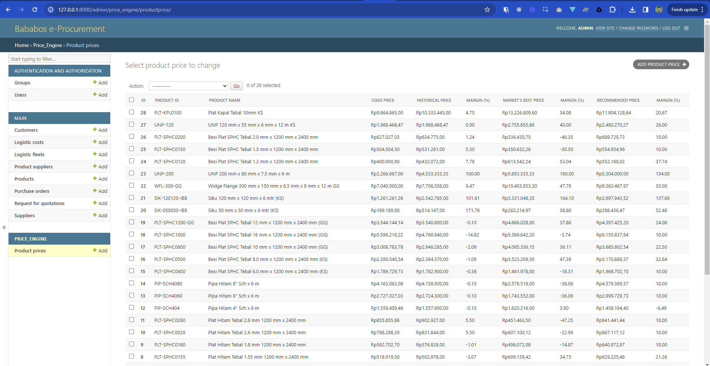
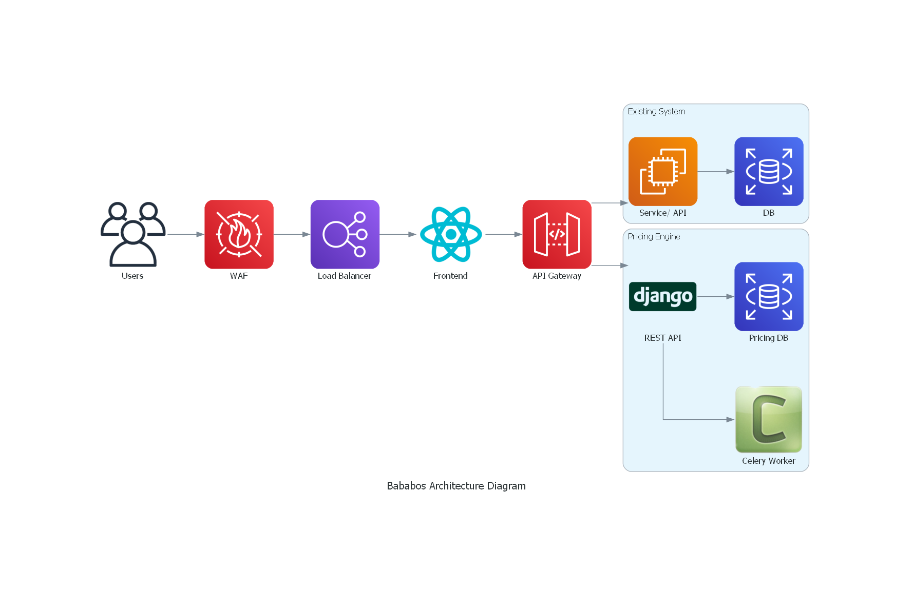
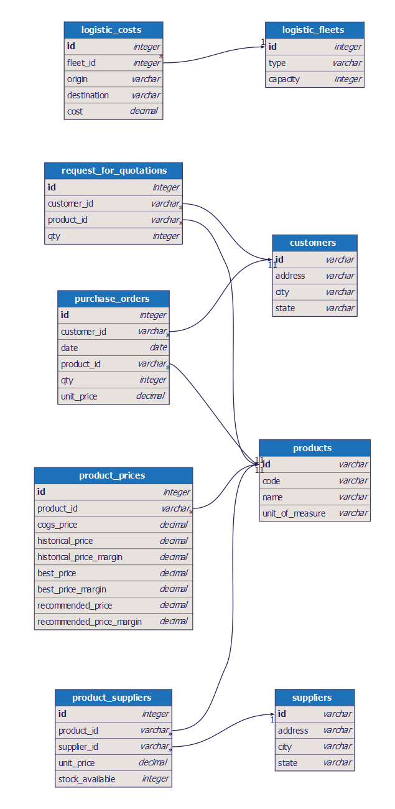

<div id="top"></div>


<!-- PROJECT LOGO -->
<br />
<div align="center">
  <a href="#">
    
  </a>

<h3 align="center"></h3>

  <p align="center">
    Streamlining Manufacturer's Procurement
  </p>
</div>


<!-- TABLE OF CONTENTS -->
<details>
  <summary>Table of Contents</summary>
  <ol>
    <li>
      <a href="#about-the-project">About The Project</a>
      <ul>
        <li><a href="#built-with">Built With</a></li>
        <li><a href="#architecture-diagram">Architecture Diagram</a></li>
        <li><a href="#entity-relationship-diagram-erd">Entity Relationship Diagram (ERD)</a></li>
      </ul>
    </li>
    <li>
      <a href="#getting-started">Getting Started</a>
      <ul>
        <li><a href="#prerequisites">Prerequisites</a></li>
        <li><a href="#installation">Installation</a></li>
        <li><a href="#troubleshooting">Troubleshooting</a></li>
      </ul>
    </li>
    <li><a href="#seeding">Seeding</a></li>
    <li><a href="#pricing-engine">Pricing Engine</a></li>
  </ol>
</details>


<!-- ABOUT THE PROJECT -->
## About The Project

The goal of the pricing engine is to maximize profit for Bababos, but still offer competitive
prices in the market (which are slightly lower or at par with the market's best price).



<p align="right">(<a href="#top">back to top</a>)</p>


### Built With

* [Django](https://www.djangoproject.com/)
* [Django admin site](https://docs.djangoproject.com/en/5.0/ref/contrib/admin/)
* [PostgreSQL](https://www.postgresql.org/)

<p align="right">(<a href="#top">back to top</a>)</p>


### Architecture Diagram



<p align="right">(<a href="#top">back to top</a>)</p>


### Entity Relationship Diagram (ERD)



<p align="right">(<a href="#top">back to top</a>)</p>

<!-- GETTING STARTED -->
## Getting Started

This is an instructions on setting up your project locally.
To get a local copy up and running follow these simple steps.

### Prerequisites

Make sure you already clone this repository from Github.

<p align="right">(<a href="#top">back to top</a>)</p>

### Installation

#### Docker

Currently only used for the database.

Make sure you already install [Docker Desktop](https://www.docker.com/products/docker-desktop). Then run this:

```sh
docker-compose up
```

<p align="right">(<a href="#top">back to top</a>)</p>

#### Django Setup

1. Create virtualenv

   ```sh
   python3 -m venv env
   ```

2. Activate virtualenv

   ```sh
   source env/Scripts/activate # or source env/bin/activate
   ```

3. Install dependencies

   ```sh
   pip3 install -r requirements.txt
   ```

<p align="right">(<a href="#top">back to top</a>)</p>


<!-- Troubleshooting -->
### Troubleshooting

<p align="right">(<a href="#top">back to top</a>)</p>


<!-- SEEDING -->
## Seeding

Run Django migration.

```sh
./manage.py migrate
```

Seeding the database with initial data.

```sh
./manage.py import_customer datasets/customer.csv
./manage.py import_supplier datasets/supplier.csv
./manage.py import_product datasets/historical\ PO\ data.csv
./manage.py import_product_supplier datasets/pricelist.csv
./manage.py import_rfq datasets/RFQ\ Customer.csv
./manage.py import_po datasets/historical\ PO\ data.csv
./manage.py import_logistic_cost datasets/logistic-fleet.csv
./manage.py import_logistic_cost datasets/logistic-cost.csv
```

<p align="right">(<a href="#top">back to top</a>)</p>


<!-- PRICING ENGINE -->
## Pricing Engine

To run the pricing engine, run this command:

```sh
./manage.py price_engine
```

Create a superuser for the admin site.

```sh
./manage.py createsuperuser
```

To view the user interface, run this command:

```sh
./manage.py runserver
```

Then open your browser & go to http://127.0.0.1:8000/admin